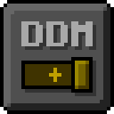

    
    <h1 align="center">Default Dark Mode: Expansion</h1>
    <h2 align="center">An Add-on for the Default Dark Mode Resource Pack for Minecraft: Java Edition</h2>

    
    
    
    
    
    
    

    Default Dark Mode Expansion is an add-on of Default Dark Mode. It adds/fixes over 100+ mods! It is recommended to use both resource packs together for the best Default Dark Mode experience possible.

## Download
 

## Mod Support

A list of supported mods can be found on the [wiki](https://github.com/nebuIr/Default-Dark-Mode/wiki/Mod-support).

## Screenshots (Default Dark Mode: Expansion)

  
  

#
## Server Partner Banner Unavailable
