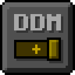



    
    <h1 align="center">Default Dark Mode: Expansion</h1>
    <h3 align="center">An Add-on for <a href="https://github.com/nebuIr/Default-Dark-Mode">Default Dark Mode</a> by NebuIr — 135+ Mods Darkened</h3>

    
    
    
    

    
    
    
    
    
    

    An add-on for <b>Default Dark Mode</b> that adds, improves and updates textures for <b>over 135 Minecraft mods (v2026.7.20 & higher)</b>. 
    Use it <b>together with the original Default Dark Mode</b> pack for the best experience.

## 📥 Download

| Platform | Link |
|---|---|
| **Modrinth** | [modrinth.com/resourcepack/default-dark-mode-expansion](https://modrinth.com/resourcepack/default-dark-mode-expansion) |
| **CurseForge** | [curseforge.com/minecraft/texture-packs/default-dark-mode-expansion](https://www.curseforge.com/minecraft/texture-packs/default-dark-mode-expansion) |
| **Planet Minecraft** | [planetminecraft.com/texture-pack/default-dark-mode-expansion-1-19-1-21](https://www.planetminecraft.com/texture-pack/default-dark-mode-expansion-1-19-1-21) |
| **Codeberg** mirror | [codeberg.org/aric3435/Default-Dark-Mode-Expansion](https://codeberg.org/aric3435/Default-Dark-Mode-Expansion) |
| **GitHub** | [github.com/aricloverEXTRA/Default-Dark-Mode-Expansion](https://github.com/aricloverEXTRA/Default-Dark-Mode-Expansion) |

> **Note:** Latest version is tracked via **Modrinth / CurseForge** — GitHub Releases mirrors the same build.

  

## ✨ About

Default Dark Mode: Expansion extends NebuIr's Default Dark Mode with dark-themed GUIs for **135+ mods** — from JEI, REI, Applied Energistics 2 and Create to Twilight Forest, Mekanism, Botania and more. Place this pack **above** Default Dark Mode in your resource pack list.

## 🧩 Mod Support

Full list of supported mods is on the [wiki](https://github.com/nebuIr/Default-Dark-Mode/wiki/Mod-support).

> Pack currently covers **135+ mods** in `assets/` (+ 1.21 overlay) — counted for `v2026.7.20` / `2026.9.1`.

## 🖼️ Screenshots

  
  

## 📦 Installation

1. Install [Default Dark Mode](https://modrinth.com/resourcepack/default-dark-mode) by NebuIr.
2. Download **Default Dark Mode: Expansion** from Modrinth / CurseForge / Codeberg.
3. Place both packs in `resourcepacks/` and enable them — **Expansion on top**.

## 🤝 Contributing

Contributions welcome! See [CONTRIBUTING.md](./CONTRIBUTING.md) for style guide and the batch-darkening script.

By contributing you agree to license your contribution under the same terms as this repo (MIT for code, All Rights Reserved for assets) and confirm you have the right to do so.

## 📄 License

- **Code** (scripts, configs, workflows) — **MIT**, see [LICENSE.txt](./LICENSE.txt)
- **Assets** (all textures under `assets/` / `assets_1.21/`) — **All Rights Reserved**, see [LICENSE_ASSETS.txt](./LICENSE_ASSETS.txt)

Official distribution only on **CurseForge · Modrinth · Planet Minecraft · GitHub / Codeberg Releases**. See [PERMISSIONS.md](./PERMISSIONS.md) for reviews & modpack rules.

## 🙏 Credits

- Original pack by [NebuIr](https://github.com/nebuIr/Default-Dark-Mode)
- Expansion maintained by [aricloverEXTRA](https://github.com/aricloverEXTRA) · Codeberg: [aric3435](https://codeberg.org/aric3435)
- All mod textures © their respective authors — included with permission or under their original licenses.

